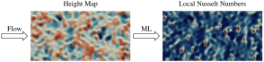
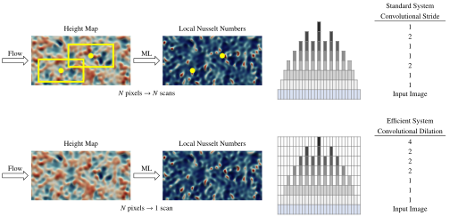

# Machine-Learning-Distributed-Nusselt-Numbers-Efficient

### Summary

This GitHub repository presents a (simplified) example using the convolutional neural network described in this publication:

* Rafael Diez Sanhueza, Ido Akkerman, Jurriaan W.R. Peeters (2023). Machine learning for the prediction of the local skin friction factors and Nusselt numbers in turbulent flows past rough surfaces. https://www.sciencedirect.com/science/article/pii/S0142727X23001030

The code (in this GitHub repository) includes all the software to:
- Pre-process the rough surface data.
- Train the convolutional neural network (PyTorch).
- Post-process the results.
- Create an automated PowerPoint presentation with the details for each case.

### Convolutional Neural Network with Optimal Time and Space Complexity

In a traditional convolutional neural network, each input image must be processed once to obtain a scalar number (i.e. prediction). While this is useful for image classification, the objective of this software is to scan the input height maps of rough surfaces, and to predict their local (2D) Nusselt number distributions:

This presents a technical challenge, since a traditional neural network would need to scan the input image (height map) once to predict each pixel found in the "local (2D) Nusselt number distributions". To solve this issue, an optimized convolutional network was developed, which replaces traditional stride operators by (convolutional) dilation. Thanks to this, an image must only be scanned once to predict the local (2D) Nusselt distributions:

In our target application, the optimized convolutional neural network is thousands of times faster during both the training and evaluation stages. This greatly facilitated further research, where the machine learning system was used to optimize dimpled surfaces.

